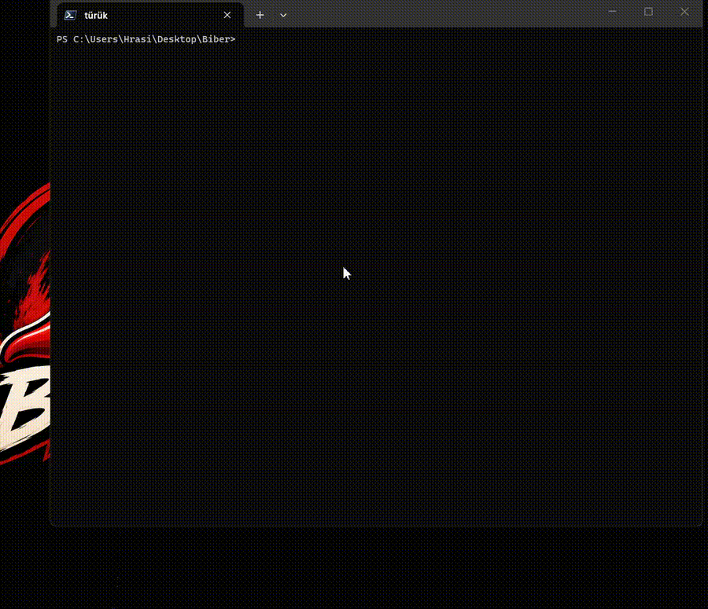

# Biber

Lightweight binary inspection tool written in Zig.



Biber is a lightweight binary inspection tool written in Zig.

It was originally created while exploring executable formats during x86 kernel development and has since grown into a standalone utility for inspecting ELF and PE binaries.

The goal of Biber is to provide a simple and readable view of executable internals without requiring large reverse engineering frameworks.

With new feature already you can see ARM attrs:

```bash
ARM ATTRIBUTES (.ARM.attributes)
    Vendor: aeabi
    Tag_CPU_name        : Cortex-M4  
    Tag_CPU_arch        : 13 (v7E-M)  
    Tag_CPU_arch_profile: 'M' -> Microcontroller (Cortex-M)  
    Tag_THUMB_ISA_use   : 2 (Thumb-2) 
```

 


> Project status: v0.2 came :)


---

## Features

### ELF

- ELF Header parsing
- Program Header parsing
- Section Header parsing
- Symbol table parsing
- Relocation parsing
- Dynamic section parsing
- Notes parsing
- GNU Hash / SYSV Hash parsing
- ARM attributes if exists **New Feature**

### PE

- DOS Header parsing
- NT Header parsing
- Section parsing
- Import Table parsing
- Export Table parsing
- Base Relocation parsing
- Exception Directory parsing
- Debug Directory parsing
- TLS Directory parsing
- Data Directory overview

### Utilities

- Entry point inspection
- RVA and offset analysis
- Hex dump viewer
- Built-in disassembler
- Executable format detection

---

## Supported Formats

| Format | Status |
|--------|--------|
| ELF32  | Yes    |
| ELF64  | Yes    |
| PE32   | Yes    |
| PE32+  | Yes    |

---

## Build

```bash
zig build -Doptimize=ReleaseSmall
```

Linux:

```bash
zig build -Doptimize=ReleaseSmall -Dtarget=x86_64-linux-gnu
```

Windows:

```bash
zig build -Doptimize=ReleaseSmall
```

---

## Usage

Inspect everything:

```bash
Biber -f limon.exe -all
```

Headers:

```bash
Biber -f limon.exe -headers
```

Sections:

```bash
Biber -f limon.exe -sections
```

Symbols:

```bash
Biber -f limon.exe -symbols
```

PE Imports:

```bash
Biber -f limon.exe -pe-imports
```

PE Exports:

```bash
Biber -f limon.exe -pe-exports
```

Disassembler:

```bash
Biber -f limon.exe -dis 0x1000 64
```

ARM attributes: **New Feature**
```bash
Biber -f tamgaos.elf -elf-arm-attrs
```

## Project Links

GitHub:  
https://github.com/hrasityilmaz/Biber

Codeberg:  
https://codeberg.org/hrasity/Biber

Devlog:  
https://auctra.app

---

