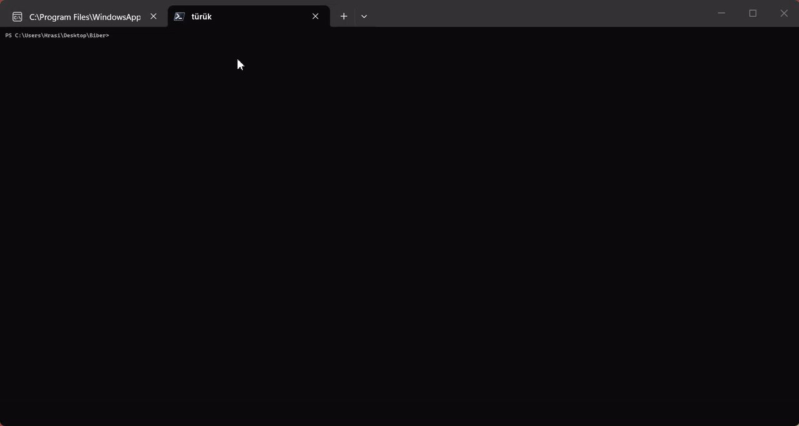

# Biber



Binary inspection tool — Still under active development!!

Using it for tests for now, but if you wanna follow along →
https://auctra.app

---

## Current Features

- Detect executable format (ELF / PE)
- Parse ELF headers
- Parse Program Headers
- Parse Section Headers
- Show entry point
- Show segment permissions (R/W/X)
- Hexdump arbitrary regions

## Build

```bash
zig build
```

## Run

```bash
./zig-out/bin/Biber file
```

## Devlog

https://auctra.app
